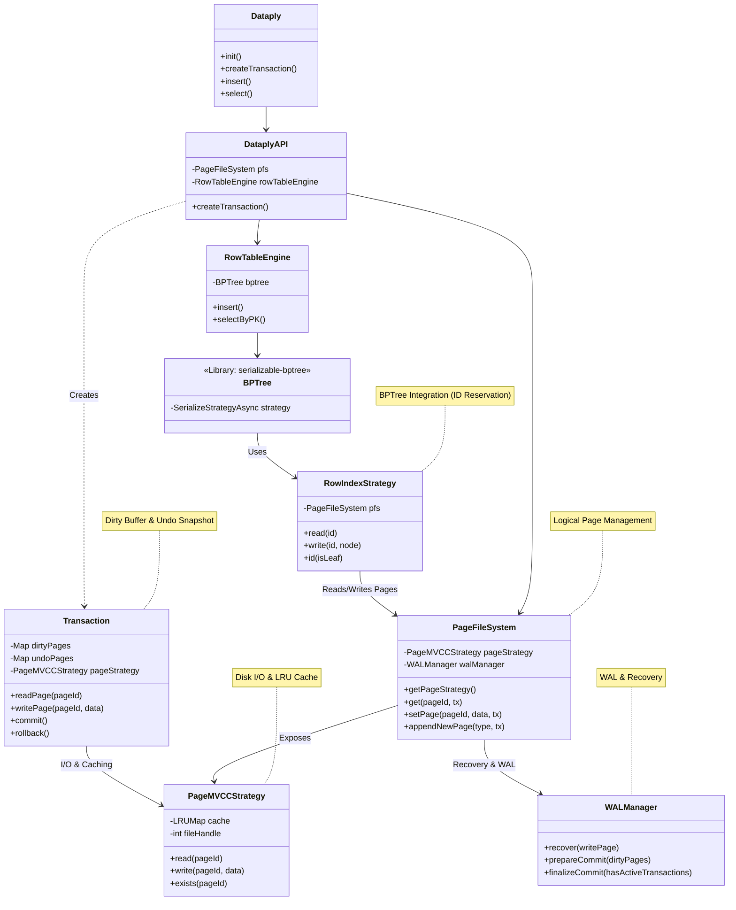
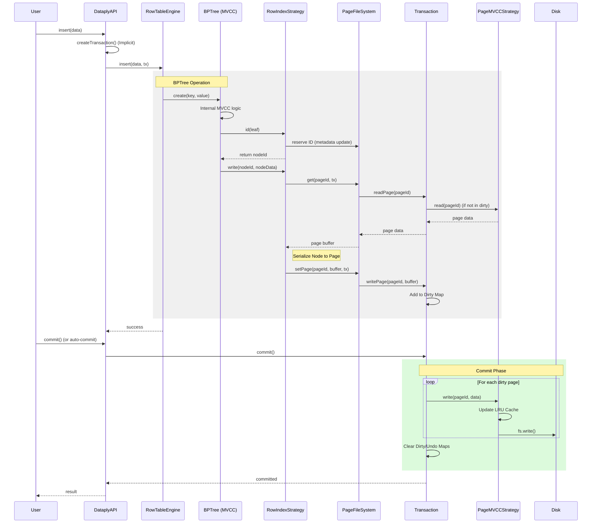

# Dataply Architecture

This document describes the internal architecture of Dataply version 0.0.17-alpha.

## System Overview

Dataply is an embedded database based on B+Tree indexing and page-based storage engine. It supports transaction management and Write-Ahead Logging (WAL).

### Class Diagram

### Component Details

#### 1. Dataply & DataplyAPI
- **Role**: Top-level interface for user interaction.
- **Responsibilities**:
  - Database initialization and shutdown (`init`, `close`).
  - Transaction context creation and management (`createTransaction`).
  - Delegation of requests to lower-level engines (`ROW_TABLE`, `KEY_VALUE`, etc.).

#### 2. Transaction
- **Role**: Unit of work manager for ACID transactions.
- **Responsibilities**:
  - **Dirty Buffer**: Temporarily buffer modified pages in memory within a transaction.
  - **Undo Snapshot**: Preserve the state of pages before modification to support rollback and isolation (MVCC).
  - **Lock Acquisition**: Request acquisition of page-level locks.

#### 3. PageMVCCStrategy
- **Role**: Strategy implementation responsible for physical storage and caching of data.
- **Responsibilities**:
  - **I/O Handling**: Perform actual read/write operations against the OS file system.
  - **LRU Cache**: Optimize performance by caching frequently accessed pages in memory.
  - Operates independently of transactions, ensuring consistent physical access.

#### 4. WALManager
- **Role**: Logging and recovery system for data integrity.
- **Responsibilities**:
  - **WAL (Write-Ahead Logging)**: Sequentially record page changes to a log file before writing to disk.
  - **Recovery**: Perform data recovery (Redo) based on logs in case of abnormal shutdown.

#### 5. PageFileSystem
- **Role**: Logical manager for page units.
- **Responsibilities**:
  - Page allocation and deallocation (`appendNewPage`, `freePage`).
  - Metadata management (page count, root node ID, etc.).
  - Translating logical page IDs to physical access via `PageMVCCStrategy`.

#### 6. RowIndexStrategy
- **Role**: Mediator between B+Tree and the page system.
- **Responsibilities**:
  - **ID Reservation**: Prevents MVCC conflicts by reserving IDs without immediately creating physical pages when B+Tree nodes are requested.
  - Handles serialization/deserialization between B+Tree node objects (JSON/Struct) and binary pages.

## Transaction Write Flow

The following diagram illustrates the call flow during data insertion. It shows how changes in the B+Tree are stored in the transaction buffer via the page system and persisted to disk at commit time.

## Refactoring Notes

### 1. Resolving MVCC Layer Conflicts
Previously, complex MVCC logic was handled at the VFS level. However, with `serializable-bptree` v8 introducing its own `mvcc-api`, a **Double MVCC Conflict** issue arose.

To resolve this, the structure was simplified as follows:
- **Transaction**: Lightweight management focusing only on `Dirty Buffer` and `Undo Snapshot` instead of complex state management.
- **PageMVCCStrategy**: Dedicated solely to pure disk I/O and caching (LRU).
- **BPTree Integration**: In `RowIndexStrategy`, page ID reservation was separated from actual creation to prevent the B+Tree's internal MVCC from misidentifying new keys as "already existing."

### 2. File System Role Separation
- **WALManager**: Dedicated to WAL (Write-Ahead Log) management and recovery.
- **PageFileSystem**: Handles logical page management and metadata processing.
- **PageMVCCStrategy**: Manages physical file access and caching strategies.

