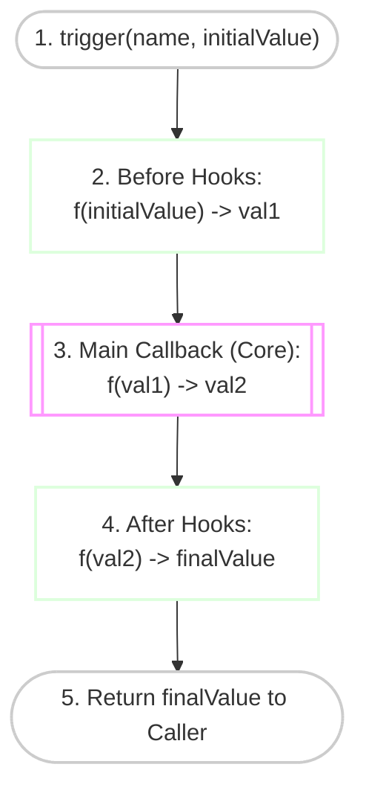
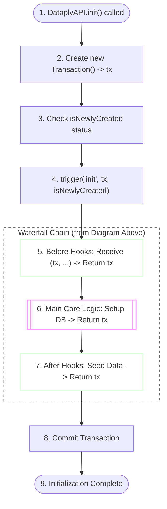

# Extending Dataply Guide

Dataply provides a flexible extension system through the `DataplyAPI` class and a powerful Hook mechanism. This guide explains how to build custom functionality on top of the Dataply core.

---

## Core Concept: Hook System

Dataply's internal Hook system is powered by the [hookall](https://github.com/izure1/hookall) library. It allows you to intercept internal processes and inject custom logic at specific lifecycles.

- **Inheritance**: Extend `DataplyAPI` to access internal protected members (pfs, rowTableEngine, etc.).
- **Events**: Register listeners for events like `init`, `close`, and CRUD operations.
- **Interception**: Modify data or control flow before or after core operations.

### Hook Execution Flow (Waterfall Pattern)

The `trigger` method in Dataply (via `hookall`) acts as a data pipeline. Values are passed through each stage, transformed, and finally returned to the caller.



1.  **Before Hooks**: Intercept and pre-process the `initialValue` before the core logic executes.
2.  **Main Callback**: The engine's core logic, which operates on the potentially modified value from the Before Hooks and returns a result.
3.  **After Hooks**: Receive the result from the Main Callback as their input, potentially transforming it. The final value from the last After Hook is returned to the original `trigger()` caller.

---

### Case Study: Database Initialization (`init`)

Now, let's see how the **Waterfall Pattern** above is applied to the actual `init` process. In this case, the `initialValue` is the newly created **Transaction (tx)** object.



> [!IMPORTANT]
> **The Waterfall Pattern in Action**:
> Hooks are executed **sequentially**. Each hook *must* return the `tx` object (or the relevant data) to the next stage. If a hook fails to return a value, the entire chain breaks, leading to `undefined` errors or transaction failures.

---

## Inheritance and Basic Hooks

The most common way to extend Dataply is to create a subclass of `DataplyAPI`.

### Basic Example: Initializing with Default Data
You can use the `onceAfter` hook to perform one-time setup tasks, such as creating initial configuration records when the database is first created.

```typescript
import { DataplyAPI, type DataplyOptions, Transaction } from 'dataply';

class MyExtendedAPI extends DataplyAPI {
  constructor(file: string, options: DataplyOptions) {
    super(file, options);

    // Register a hook that runs ONLY ONCE after 'init' completes
    this.hook.onceAfter('init', async (tx, isNewlyCreated) => {
      if (isNewlyCreated) {
        console.log('✨ Database newly created. Seeding initial data...');
        
        // Always pass the 'tx' argument to prevent deadlocks (see Safety Rules below)
        const pk = await this.insertAsOverflow(
          JSON.stringify({ nickname: 'admin', role: 'superuser' }), 
          false, 
          tx
        );
        console.log(`✅ Welcome record created with PK: ${pk}`);
      }
      
      // CRITICAL: Always return the tx object
      return tx;
    });
  }
}
```

---

## Transaction (tx) Safety Rules

When working within Hooks, following these rules is **mandatory** to prevent system hangs or data corruption.

When working within Hooks, following these rules is **mandatory** to prevent system hangs or data corruption.

### 1. Always Return the `tx` object
Asynchronous hooks (like `init`) receive a `tx` object and must return it. This ensures the transaction chain continues correctly.

### 2. Reuse the Provided `tx`
Always pass the `tx` argument to internal methods (`insert`, `update`, etc.) within a hook. 

> [!CAUTION]
> **Risk of Deadlocks**: When a hook is triggered, the engine might already hold a **Write Lock** on certain pages. Calling a method without the existing `tx` will cause Dataply to attempt a *new* transaction, which will wait indefinitely for the lock held by the parent hook—resulting in a permanent hang.

---

## Best Practice: Custom Metadata Strategy

You can store application-specific metadata (schema versions, settings, etc.) directly in the database by leveraging the uniqueness of the first record.

- **PK 1 is Special**: The first successful insertion in a new Dataply instance is guaranteed to have `pk: 1`.
- **Custom Metadata Page**: Use `pk: 1` as your own "Internal Configuration Page".
- **Update Logic**: Instead of inserting new records, keep your configuration updated at `pk: 1`.

### Implementation Example
```typescript
this.hook.onceAfter('init', async (tx, isNewlyCreated) => {
  if (isNewlyCreated) {
    // Save versioning info at PK 1
    const initialConfig = { version: '1.0.0', lastUpdate: Date.now() };
    await this.insertAsOverflow(JSON.stringify(initialConfig), false, tx);
  } else {
    // Load existing config
    const config = await this.select(1, false, tx);
    console.log('🛠️ Current Schema Version:', JSON.parse(config).version);
  }
  return tx;
});
```

---

## Recommended Architecture: Business Logic Wrapping

For professional applications, wrap your extended API in a service class to provide a clean, high-level interface.

```typescript
class MyDatabaseService {
  protected readonly api: MyExtendedAPI;

  constructor(file: string, options?: DataplyOptions) {
    this.api = new MyExtendedAPI(file, options ?? {});
  }

  async start() {
    await this.api.init();
  }

  async upsertConfig(newConfig: object) {
    // runWithDefault automates internal transaction handling
    return this.api.runWithDefault(async (tx) => {
      return this.api.update(1, JSON.stringify(newConfig), tx);
    });
  }

  async stop() {
    await this.api.close();
  }
}
```

---

## Hook Event Reference

| Event | Trigger Point | Arguments | Return Value |
| :--- | :--- | :--- | :--- |
| `init` | Called during `DataplyAPI.init()` | `(tx: Transaction, isNewlyCreated: boolean)` | `Promise<Transaction>` |
| `close` | Called during `DataplyAPI.close()` | `()` | `Promise<void>` |

> [!TIP]
> For advanced use cases, you can access protected members like `this.pfs` (Page File System) or `this.rowTableEngine` within your subclass to perform low-level page manipulations.

---
*For internal type definitions, see the `DataplyAPIAsyncHook` interface in [DataplyAPI.ts](../src/core/DataplyAPI.ts).*
