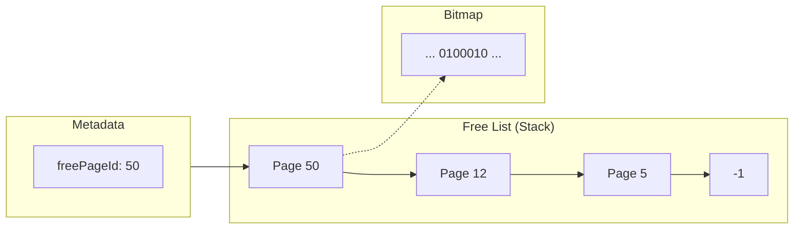

# Page Reclamation and Reuse Mechanism

Dataply features a smart reclamation system that detects unused data and immediately transitions that space back to an available state, maximizing limited disk resources.

---

## 1. When Page Reclamation Occurs
The database releases physical space and returns it to the system in the following scenarios:

- **Row Deletion**: When a page becomes empty after a deletion, it is marked for reclamation.
- **Overflow Truncation**: When data size decreases or is deleted, unused overflow chains are released immediately.
- **Node Merging**: In B+Trees, pages from merged nodes are returned to the available pool.

---

## 2. Core Components

| Component | Role | Description |
| :--- | :--- | :--- |
| **Bitmap Page** | **Status Map** | A map that uses 1 bit per page to track the allocation status of all pages in the database. (1: Free, 0: Used) |
| **Free List** | **Standby Queue** | Manages empty pages linked together in a stack-like structure (Linked List). |
| **Metadata** | **Control Tower** | Stores the ID of the first page available for reuse (`freePageId`). |

---

## 3. Page Lifecycle

### Phase 1: Page Reclamation (Freeing)
Registers space into the list to ensure room for new data.

> [!TIP]
> **Atomicity Guarantee**: This process is performed within a transaction. Write locks on both the Metadata and the target page ensure data consistency.

1.  **Header Reset**: Change the page type to `EmptyPage`.
2.  **Stack Push**: Point the target page's `nextPageId` to the current `freePageId`.
3.  **Pointer Sync**: Update the `freePageId` in metadata to the current page's ID.
4.  **Bitmap Set**: Set the corresponding bit to `1 (Free)` for fast lookup.

### Phase 2: Page Reuse (Allocation)
Before expanding the file size, the system prioritizes taking space from the reclaimed list.

1.  **Availability Check**: Verify if `freePageId` is `-1`.
2.  **Stack Pop**:
    - If not `-1`, extract the page at the front of the list.
    - Update `freePageId` to the `nextPageId` of the extracted page.
3.  **Type Reset**: Re-initialize the header and set bitmap bit to `0 (Used)`.

---

## 4. Visualization

---

## 5. Value of the Bitmap-Based Approach

*   **Performance Optimization**: Quickly finds empty space using only the bitmap (which can be cached in memory) without having to open and inspect actual page data on disk.
*   **Fragmentation Prevention**: Suppresses indiscriminate file expansion and prioritizes filling "holes" within the file to increase data density.
*   **Rapid Recovery**: Upon restart after an abnormal shutdown, the system can quickly verify storage integrity by cross-referencing the bitmap with header information.
