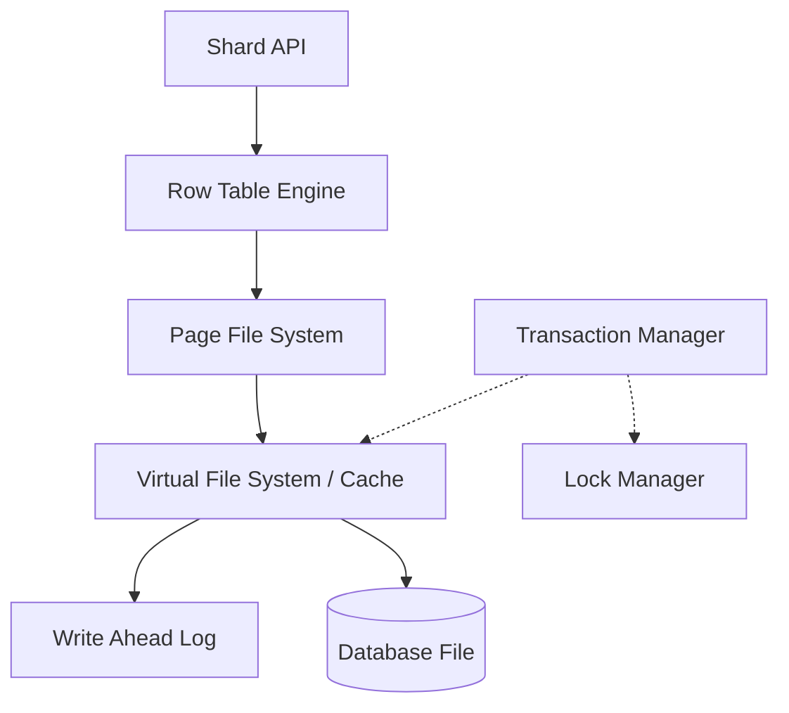

# Shard

> [!WARNING]
> **Shard is currently in Alpha version.** It is experimental and not yet suitable for production use.

**Shard** is a lightweight, high-performance **Record Store** designed for Node.js. It focuses on storing arbitrary data and providing an auto-generated Primary Key (PK) for ultra-fast retrieval, while supporting core enterprise features like MVCC, WAL, and atomic transactions.

## Key Features

- **🚀 Identity-Based Access**: Specialized in storing records and managing them via auto-generated Primary Keys.
- **⚡ High-Performance B+Tree**: Optimizes data lookup and insertion through an asynchronous B+Tree structure.
- **🛡️ MVCC Support**: Enables non-blocking read operations and guarantees data isolation between transactions.
- **📝 WAL (Write-Ahead Logging)**: Ensures data integrity and provides recovery capabilities in case of system failures.
- **💼 Transaction Mechanism**: Supports Commit and Rollback for atomic operations.
- **📦 Page-Based Storage**: Efficient page caching and disk I/O optimization through Virtual File System (VFS).
- **⌨️ TypeScript Support**: Provides comprehensive type definitions for all APIs.

## Installation

### Prerequisites

- **Node.js**: v18.0.0 or higher

```bash
npm install shard
```

## Quick Start

```typescript
import { Shard } from 'shard'

// Open Shard instance
const shard = new Shard('./data.db', {
  pageSize: 8192,
  wal: './data.db.wal'
})

async function main() {
  // Initialization (Required)
  await shard.init()

  // Insert data
  const pk = await shard.insert('Hello, Shard!')
  console.log(`Inserted row with PK: ${pk}`)

  // Update data
  await shard.update(pk, 'Updated Data')
  console.log(`Updated row with PK: ${pk}`)

  // Select data
  const data = await shard.select(pk)
  console.log(`Read data: ${data}`)

  // Delete data
  await shard.delete(pk)
  console.log(`Deleted row with PK: ${pk}`)

  // Close shard
  await shard.close()
}

main()
```

## Transaction Management

### Explicit Transactions
You can group multiple operations into a single unit of work to ensure atomicity.

```typescript
const tx = shard.createTransaction()

try {
  await shard.insert('Data 1', tx)
  await shard.update(pk, 'Updated Data', tx)
  
  await tx.commit() // Persist changes to disk and clear WAL on success
} catch (error) {
  await tx.rollback() // Revert all changes on failure (Undo)
}
```

### Auto-Transaction
If you omit the `tx` argument when calling methods like `insert`, `update`, or `delete`, Shard internally **creates an individual transaction automatically**.

- **Guaranteed Atomicity**: Even single operations are processed within an internal transaction, ensuring they are only finalized on success and rolled back on failure.
- **Performance Note**: For batch processing or multiple related operations, wrapping them in a single explicit transaction is significantly faster than relying on auto-transactions due to reduced I/O overhead.

## API Reference

### Shard Class

#### `constructor(file: string, options?: ShardOptions): Shard`
Opens a database file. If the file does not exist, it creates and initializes a new one.
- `options.pageSize`: Size of a page (Default: 8192, must be a power of 2)
- `options.pageCacheCapacity`: Maximum number of pages to keep in memory (Default: 10000)
- `options.wal`: Path to the WAL file. If omitted, WAL is disabled.

#### `async init(): Promise<void>`
Initializes the instance. Must be called before performing any CRUD operations.

#### `async insert(data: string | Uint8Array, tx?: Transaction): Promise<number>`
Inserts new data. Returns the Primary Key (PK) of the created row.

#### `async insertBatch(dataList: (string | Uint8Array)[], tx?: Transaction): Promise<number[]>`
Inserts multiple rows at once. This is significantly faster than multiple individual inserts as it minimizes internal transaction overhead.

#### `async select(pk: number, asRaw?: boolean, tx?: Transaction): Promise<string | Uint8Array | null>`
Retrieves data based on the PK. Returns `Uint8Array` if `asRaw` is true.

#### `async update(pk: number, data: string | Uint8Array, tx?: Transaction): Promise<void>`
Updates existing data.

#### `async delete(pk: number, tx?: Transaction): Promise<void>`
Marks data as deleted.

#### `async getMetadata(): Promise<ShardMetadata>`
Returns the current metadata of the shard, including `pageSize`, `pageCount`, and `rowCount`.

#### `createTransaction(): Transaction`
Creates a new transaction instance.

#### `async close(): Promise<void>`
Closes the file handles and shuts down safely.

### Transaction Class

#### `async commit(): Promise<void>`
Permanently reflects all changes made during the transaction to disk and releases locks.

#### `async rollback(): Promise<void>`
Cancels all changes made during the transaction and restores the original state.

## Extending Shard

If you want to extend Shard's functionality, use the `ShardAPI` class. Unlike the standard `Shard` class, `ShardAPI` provides direct access to internal components like `PageFileSystem` or `RowTableEngine`, offering much more flexibility for custom implementations.

### Using ShardAPI

```typescript
import { ShardAPI } from 'shard'

class CustomShard extends ShardAPI {
  // Leverage internal protected members (pfs, rowTableEngine, etc.)
  async getInternalStats() {
    return {
      pageSize: this.options.pageSize,
      // Custom internal logic here
    }
  }
}

const custom = CustomShard.Use('./data.db')
await custom.init()

const stats = await custom.getInternalStats()
console.log(stats)
```

## Internal Architecture

Shard implements the core principles of high-performance storage systems in a lightweight and efficient manner.

### 1. Layered Architecture


### 2. Page-Based Storage and VFS Caching
- **Fixed-size Pages**: All data is managed in fixed-size units (default 8KB) called pages.
- **VFS Cache**: Minimizes disk I/O by caching frequently accessed pages in memory.
- **Dirty Page Tracking**: Tracks modified pages (Dirty) to synchronize them with disk efficiently only at the time of commit.

### 3. MVCC and Snapshot Isolation
- **Non-blocking Reads**: Read operations are not blocked by write operations.
- **Undo Log**: When a transaction modifies a page, it keeps the original data in an **Undo Buffer**. Other transactions trying to read the same page are served this snapshot to ensure consistent reads.
- **Rollback Mechanism**: Upon transaction failure, the Undo Buffer is used to instantly restore pages to their original state.

### 4. WAL (Write-Ahead Logging) and Crash Recovery
- **Performance and Reliability**: All changes are recorded in a sequential log file (WAL) before being written to the actual data file. This converts random writes into sequential writes for better performance and ensures data integrity.
- **Crash Recovery**: When restarting after an unexpected shutdown, Shard reads the WAL to automatically replay (Redo) any changes that weren't yet reflected in the data file.

### 5. Concurrency Control and Indexing
- **Page-level Locking**: Prevents data contention by controlling sequential access to pages through the `LockManager`.
- **B+Tree Index**: Uses a B+Tree structure guaranteeing $O(\log N)$ performance for maximized PK lookup efficiency.

## Performance

Shard is optimized for high-speed data processing. Below are the results of basic benchmark tests conducted on a local environment.

| Test Case | Count | Total Time | OPS (Operations Per Second) |
| :--- | :--- | :--- | :--- |
| **Bulk Insert (Batch)** | 10,000 | ~1,207ms | **~8,281 OPS** |
| **Bulk Insert (Individual)** | 100 | ~47ms | **~2,121 OPS** |
| **Bulk Insert with WAL** | 100 | ~946ms | **~105 OPS** |
| **Medium Row Insert (1KB)** | 100 | ~52ms | **~1,892 OPS** |

### Benchmark Analysis
- **Batching Efficiency**: Grouping operations into a single transaction is approximately **3.9x faster** than individual inserts by minimizing internal transaction management overhead.
- **WAL Trade-off**: Enabling Write-Ahead Logging ensures data durability but results in a significant performance decrease (approximately **20x slower** for individual inserts) due to synchronous I/O operations.
- **Node.js Optimization**: Shard is designed to provide competitive performance (over **8,000 OPS** in batch mode) for a pure TypeScript Record Store without native dependencies.

> [!NOTE]
> Tests were conducted on a standard local environment (Node.js v25+). Performance may vary depending on hardware specifications (especially SSD/HDD) and system load.

## Limitations

As **Shard** is currently in Alpha, there are several limitations to keep in mind:
- **PK-Only Access**: Data can only be retrieved or modified using the Primary Key. No secondary indexes or complex query logic are available yet.
- **No SQL Support**: This is a low-level **Record Store**. It does not support SQL or any higher-level query language.
- **Memory Usage**: The VFS cache size is controlled by `pageCacheCapacity`, but excessive use of large records should be handled with care.

## License

MIT
