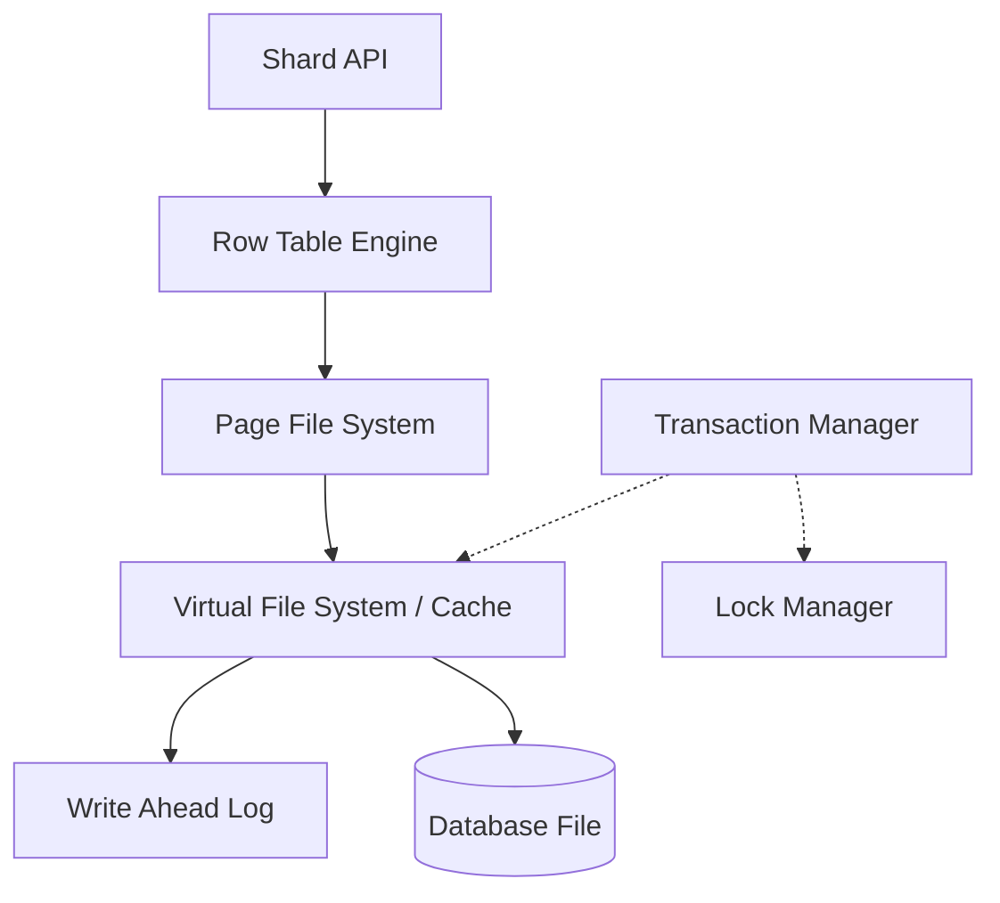

# Shard

Shard는 Node.js를 위해 설계된 경량화된 고성능 저장 엔진입니다. MVCC(Multi-Version Concurrency Control), WAL(Write-Ahead Logging), 그리고 B+Tree 인덱싱을 지원하여 안정적이고 빠른 데이터 관리를 제공합니다.

## 주요 특징

- **🚀 고성능 B+Tree 인덱싱**: Primary Key를 기반으로 한 빠른 데이터 검색 및 관리를 지원합니다.
- **🛡️ MVCC 지원**: 비차단(Non-blocking) 읽기 작업을 지원하며, 트랜잭션 간의 데이터 격리를 보장합니다.
- **📝 WAL (Write-Ahead Logging)**: 시스템 장애 발생 시에도 데이터 무결성을 유지하고 복구할 수 있는 기능을 제공합니다.
- **💼 트랜잭션 매커니즘**: 원자적 작업을 위한 Commit 및 Rollback 기능을 지원합니다.
- **📦 페이지 기반 저장**: 가상 파일 시스템(VFS)을 통한 효율적인 페이지 캐싱 및 디스크 I/O 최적화를 수행합니다.
- **⌨️ TypeScript 지원**: 모든 API에 대해 완벽한 타입 정의를 제공합니다.

## 설치

```bash
npm install shard
```

## 빠른 시작

```typescript
import { Shard } from 'shard'

async function main() {
  // Shard 인스턴스 오픈
  const shard = Shard.Open('./data.db', {
    pageSize: 8192,
    wal: './data.db.wal'
  })

  // 초기화 (필수)
  await shard.init()

  // 데이터 삽입
  const pk = await shard.insert('Hello, Shard!')
  console.log(`Inserted row with PK: ${pk}`)

  // 데이터 조회
  const data = await shard.select(pk)
  console.log(`Read data: ${data}`)

  // 샤드 종료
  await shard.close()
}

main()
```

## 트랜잭션 관리

### 명시적 트랜잭션
원자성이 필요한 여러 작업을 하나의 단위로 묶을 수 있습니다.

```typescript
const tx = shard.createTransaction()

try {
  await shard.insert('데이터 1', tx)
  await shard.update(pk, '업데이트 데이터', tx)
  
  await tx.commit() // 성공 시 디스크 반영 및 WAL 정리
} catch (error) {
  await tx.rollback() // 실패 시 모든 변경 사항 취소 (Undo)
}
```

### 자동 트랜잭션 (Auto-Transaction)
`insert`, `update`, `delete` 등의 메서드 호출 시 `tx` 인자를 생략하면, Shard가 내부적으로 **개별 트랜잭션을 자동으로 생성**합니다.

- **원자성 보장**: 단일 작업이라도 내부 트랜잭션을 통해 성공 시에만 최종 반영되며, 에러 발생 시 자동으로 롤백됩니다.
- **성능 참고**: 대량의 삽입/수정 작업 시에는 매번 자동 트랜잭션을 생성하는 것보다 하나의 명시적 트랜잭션으로 묶어 처리하는 것이 I/O 오버헤드를 줄여 훨씬 빠릅니다.

## API 레퍼런스

### Shard 클래스

#### `static Open(file: string, options?: ShardOptions): Shard`
데이터베이스 파일을 엽니다. 파일이 존재하지 않으면 새로 생성하고 초기화합니다.
- `options.pageSize`: 페이지 크기 (기본값: 8192, 2의 거듭제곱이어야 함)
- `options.wal`: WAL 파일 경로. 생략 시 WAL 기능이 비활성화됩니다.

#### `async init(): Promise<void>`
인스턴스를 초기화합니다. CRUD 작업을 수행하기 전에 반드시 호출해야 합니다.

#### `async insert(data: string | Uint8Array, tx?: Transaction): Promise<number>`
새 데이터를 삽입합니다. 생성된 행의 Primary Key(PK)를 반환합니다.

#### `async select(pk: number, asRaw?: boolean, tx?: Transaction): Promise<string | Uint8Array | null>`
PK를 기반으로 데이터를 조회합니다. `asRaw`가 true이면 `Uint8Array`를 반환합니다.

#### `async update(pk: number, data: string | Uint8Array, tx?: Transaction): Promise<void>`
기존 데이터를 업데이트합니다.

#### `async delete(pk: number, tx?: Transaction): Promise<void>`
데이터를 삭제 표시합니다.

#### `async createTransaction(): Promise<Transaction>`
새로운 트랜잭션 인스턴스를 생성합니다.

#### `async close(): Promise<void>`
파일 핸들을 닫고 안전하게 종료합니다.

### Transaction 클래스

#### `async commit(): Promise<void>`
트랜잭션 중 발생한 모든 변경 사항을 영구적으로 디스크에 반영하고 락을 해제합니다.

#### `async rollback(): Promise<void>`
트랜잭션 중 발생한 모든 변경 사항을 취소하고 원래 상태로 되돌립니다.

## 상세 작동 구조 (Internal Architecture)

Shard는 현대적인 데이터베이스 엔진의 핵심 원리를 가볍고 효율적으로 구현하고 있습니다.

### 1. 계층형 아키텍처


### 2. 페이지 기반 저장 및 VFS 캐싱
- **Fixed-size Pages**: 모든 데이터는 고정 크기(기본 8KB)의 페이지 단위로 관리됩니다.
- **VFS Cache**: 자주 액세스하는 페이지를 메모리에 캐싱하여 디스크 I/O를 최소화합니다.
- **Dirty Page Tracking**: 수정된 페이지(Dirty)를 추적하여 커밋 시점에만 효율적으로 디스크에 동기화합니다.

### 3. MVCC 및 스냅샷 격리 (Snapshot Isolation)
- **Non-blocking Reads**: 읽기 작업은 쓰기 작업에 의해 차단되지 않습니다.
- **Undo Log**: 트랜잭션이 페이지를 수정할 때, 수정 전의 원본 데이터를 **Undo Buffer**에 보관합니다. 다른 트랜잭션이 해당 페이지를 읽으려 하면 이 스냅샷을 제공하여 일관된 읽기를 보장합니다.
- **롤백 메커니즘**: 트랜잭션 실패 시 Undo Buffer를 사용하여 페이지를 즉시 원래 상태로 복구합니다.

### 4. WAL (Write-Ahead Logging) 및 장애 복구
- **성능과 안정성**: 모든 변경 사항은 실제 데이터 파일에 기록되기 전, 순차적 로그 파일(WAL)에 먼저 기록됩니다. 이는 무작위 쓰기를 순차 쓰기로 변환하여 성능을 높이고 무결성을 보장합니다.
- **Crash Recovery**: 시스템이 예기치 않게 종료된 후 재시작될 때, Shard는 WAL을 읽어 아직 데이터 파일에 반영되지 않은 변경 사항을 자동으로 복구(Redo)합니다.

### 5. 동시성 제어 및 인덱싱
- **Page-level Locking**: `LockManager`를 통해 페이지 단위 순차적 접근을 제어하여 데이터 경합을 방지합니다.
- **B+Tree 인덱스**: Primary Key 기반의 조회 성능을 극대화하기 위해 $O(\log N)$ 성능을 보장하는 B+Tree 구조를 사용합니다.

## 라이선스

MIT
