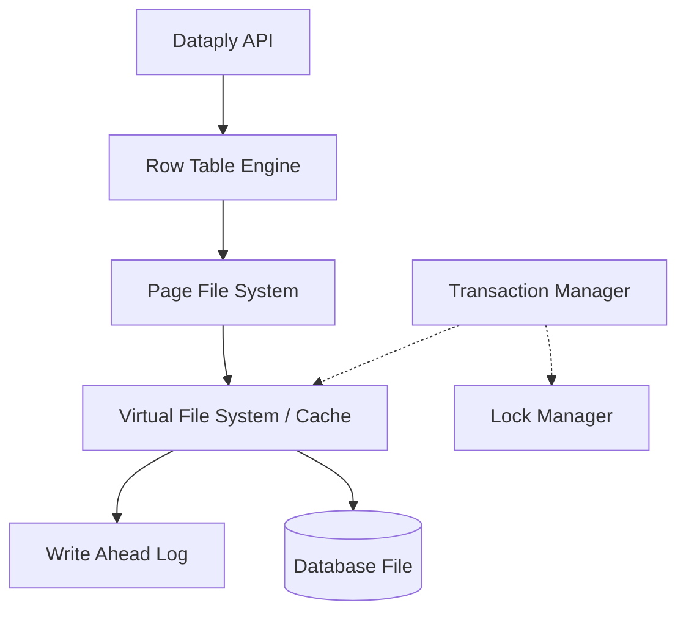

# Dataply

> [!WARNING]
> **Dataply is currently in Alpha version.** It is experimental and not yet suitable for production use. Internal data structures and file formats are subject to change at any time.

**Dataply** is a lightweight, high-performance **Record Store** designed for Node.js. It focuses on storing arbitrary data and providing an auto-generated Primary Key (PK) for ultra-fast retrieval, while supporting core enterprise features like MVCC, WAL, and atomic transactions.

## Key Features

- **🚀 Identity-Based Access**: Specialized in storing records and managing them via auto-generated Primary Keys.
- **⚡ High-Performance B+Tree**: Optimizes data lookup and insertion through an asynchronous B+Tree structure.
- **🛡️ MVCC Support**: Enables non-blocking read operations and guarantees data isolation between transactions.
- **📝 WAL (Write-Ahead Logging)**: Ensures data integrity and provides recovery capabilities in case of system failures.
- **💼 Transaction Mechanism**: Supports Commit and Rollback for atomic operations.
- **📦 Page-Based Storage**: Efficient page caching and disk I/O optimization through Virtual File System (VFS).
- **📉 Bitmap Space Optimization**: Uses bitmapped management to efficiently track page usage and maximize disk space utilization.
- **⌨️ TypeScript Support**: Provides comprehensive type definitions for all APIs.

## Installation

### Prerequisites

- **Node.js**: v18.0.0 or higher

```bash
npm install dataply
```

## Quick Start

```typescript
import { Dataply } from 'dataply'

// Open Dataply instance
const dataply = new Dataply('./data.db', {
  wal: './data.db.wal'
})

async function main() {
  // Initialization (Required)
  await dataply.init()

  // Insert data
  const pk = await dataply.insert('Hello, Dataply!')
  console.log(`Inserted row with PK: ${pk}`)

  // Update data
  await dataply.update(pk, 'Updated Data')
  console.log(`Updated row with PK: ${pk}`)

  // Select data
  const data = await dataply.select(pk)
  console.log(`Read data: ${data}`)

  // Delete data
  await dataply.delete(pk)
  console.log(`Deleted row with PK: ${pk}`)

  // Close dataply
  await dataply.close()
}

main()
```

## Transaction Management

### Explicit Transactions
You can group multiple operations into a single unit of work to ensure atomicity.

```typescript
const tx = dataply.createTransaction()

try {
  await dataply.insert('Data 1', tx)
  await dataply.update(pk, 'Updated Data', tx)
  
  await tx.commit() // Persist changes to disk and clear WAL on success
} catch (error) {
  await tx.rollback() // Revert all changes on failure (Undo)
}
```

### Global Transactions
You can perform atomic operations across multiple `Dataply` instances using the `GlobalTransaction` class. This uses a **2-Phase Commit (2PC)** mechanism to ensure that either all instances commit successfully or all are rolled back.

```typescript
import { Dataply, GlobalTransaction } from 'dataply'

const db1 = new Dataply('./db1.db', { wal: './db1.wal' })
const db2 = new Dataply('./db2.db', { wal: './db2.wal' })

await db1.init()
await db2.init()

const tx1 = db1.createTransaction()
const tx2 = db2.createTransaction()

const globalTx = new GlobalTransaction()
globalTx.add(tx1)
globalTx.add(tx2)

try {
  await db1.insert('Data for DB1', tx1)
  await db2.insert('Data for DB2', tx2)
  
  // Phase 1: Prepare (WAL write) -> Phase 2: Commit (Marker write)
  await globalTx.commit() 
} catch (error) {
  await globalTx.rollback()
}
```

### Auto-Transaction
If you omit the `tx` argument when calling methods like `insert`, `update`, or `delete`, Dataply internally **creates an individual transaction automatically**.

- **Guaranteed Atomicity**: Even single operations are processed within an internal transaction, ensuring they are only finalized on success and rolled back on failure.
- **Performance Note**: For batch processing or multiple related operations, wrapping them in a single explicit transaction is significantly faster than relying on auto-transactions due to reduced I/O overhead.

## API Reference

### Dataply Class

#### `constructor(file: string, options?: DataplyOptions): Dataply`
Opens a database file. If the file does not exist, it creates and initializes a new one.
- `options.pageSize`: Size of a page (Default: 8192, must be a power of 2)
- `options.pageCacheCapacity`: Maximum number of pages to keep in memory (Default: 10000)
- `options.wal`: Path to the WAL file. If omitted, WAL is disabled.

#### `async init(): Promise<void>`
Initializes the instance. Must be called before performing any CRUD operations.

#### `async insert(data: string | Uint8Array, tx?: Transaction): Promise<number>`
Inserts new data. Returns the Primary Key (PK) of the created row.

#### `async insertBatch(dataList: (string | Uint8Array)[], tx?: Transaction): Promise<number[]>`
Inserts multiple rows at once. This is significantly faster than multiple individual inserts as it minimizes internal transaction overhead.

#### `async select(pk: number, asRaw?: boolean, tx?: Transaction): Promise<string | Uint8Array | null>`
Retrieves data based on the PK. Returns `Uint8Array` if `asRaw` is true.

#### `async update(pk: number, data: string | Uint8Array, tx?: Transaction): Promise<void>`
Updates existing data.

#### `async delete(pk: number, tx?: Transaction): Promise<void>`
Marks data as deleted.

#### `async getMetadata(tx?: Transaction): Promise<DataplyMetadata>`
Returns the current metadata of the dataply, including `pageSize`, `pageCount`, and `rowCount`.

#### `createTransaction(): Transaction`
Creates a new transaction instance.

#### `async close(): Promise<void>`
Closes the file handles and shuts down safely.

### Transaction Class

#### `async commit(): Promise<void>`
Permanently reflects all changes made during the transaction to disk and releases locks.

#### `async rollback(): Promise<void>`
Cancels all changes made during the transaction and restores the original state.

### GlobalTransaction Class

#### `add(tx: Transaction): void`
Adds an individual transaction from a `Dataply` instance to the global transaction.

#### `async commit(): Promise<void>`
Atomically commits all added transactions using a 2-Phase Commit (2PC) process.

#### `async rollback(): Promise<void>`
Rolls back all added transactions.

## Extending Dataply

If you want to extend Dataply's functionality, use the `DataplyAPI` class. Unlike the standard `Dataply` class, `DataplyAPI` provides direct access to internal components like `PageFileSystem` or `RowTableEngine`, offering much more flexibility for custom implementations.

For a detailed guide and examples on how to extend Dataply using Hooks, see [Extending Dataply Guide](docs/extension.md).

### Using DataplyAPI

```typescript
import { DataplyAPI } from 'dataply'

class CustomDataply extends DataplyAPI {
  // Leverage internal protected members (pfs, rowTableEngine, etc.)
  async getInternalStats() {
    return {
      pageSize: this.options.pageSize,
      // Custom internal logic here
    }
  }
}

const custom = new CustomDataply('./data.db')
await custom.init()

const stats = await custom.getInternalStats()
console.log(stats)
```

## Internal Architecture

Dataply implements the core principles of high-performance storage systems in a lightweight and efficient manner.

### 1. Layered Architecture


### 2. Page-Based Storage and VFS Caching

- **Fixed-size Pages**: All data is managed in fixed-size units (default 8KB) called pages.
- **VFS Cache**: Minimizes disk I/O by caching frequently accessed pages in memory.
- **Dirty Page Tracking**: Tracks modified pages (Dirty) to synchronize them with disk efficiently only at the time of commit.
- **Bitmap Management**: Efficiently tracks the allocation and deallocation of pages using a bitmap structure, facilitating fast space reclamation and reuse. For more details on this mechanism, see [Page Reclamation and Reuse Guide](docs/page_reclamation.md).
- **Detailed Structure**: For technical details on the physical layout, see [structure.md](docs/structure.md).

#### Page & Row Layout
Dataply uses a **Slotted Page** architecture to manage records efficiently:
- **Pages**: Consists of a 100-byte header (containing `type`, `id`, `checksum`, etc.) and a body where rows are stored. Slot offsets are stored at the end of the page to track row positions.
- **Rows**: Each row has a 9-byte header (`flags`, `size`, `PK`) followed by the actual data. Large records automatically trigger **Overflow Pages** to handle data exceeding page capacity.
- **Keys & Identifiers**: Uses a 6-byte **Primary Key (PK)** for logical mapping and a 6-byte **Record Identifier (RID)** (Slot + Page ID) for direct physical addressing.

### 3. MVCC and Snapshot Isolation
- **Non-blocking Reads**: Read operations are not blocked by write operations.
- **Undo Log**: When a transaction modifies a page, it keeps the original data in an **Undo Buffer**. Other transactions trying to read the same page are served this snapshot to ensure consistent reads.
- **Rollback Mechanism**: Upon transaction failure, the Undo Buffer is used to instantly restore pages to their original state.

### 4. WAL (Write-Ahead Logging) and Crash Recovery
- **Performance and Reliability**: All changes are recorded in a sequential log file (WAL) before being written to the actual data file. This converts random writes into sequential writes for better performance and ensures data integrity.
- **Crash Recovery**: When restarting after an unexpected shutdown, Dataply reads the WAL to automatically replay (Redo) any changes that weren't yet reflected in the data file.

### 5. Concurrency Control and Indexing
- **Page-level Locking**: Prevents data contention by controlling sequential access to pages through the `LockManager`.
- **B+Tree Index**: Uses a B+Tree structure guaranteeing $O(\log N)$ performance for maximized PK lookup efficiency.

## Performance

Dataply is optimized for high-speed data processing. Below are the results of basic benchmark tests conducted on a local environment.

| Test Case | Count | Total Time | OPS (Operations Per Second) |
| :--- | :--- | :--- | :--- |
| **Bulk Insert (Batch)** | 10,000 | ~1,207ms | **~8,281 OPS** |
| **Bulk Insert (Individual)** | 100 | ~47ms | **~2,121 OPS** |
| **Bulk Insert with WAL** | 100 | ~946ms | **~105 OPS** |
| **Medium Row Insert (1KB)** | 100 | ~52ms | **~1,892 OPS** |

### Benchmark Analysis
- **Batching Efficiency**: Grouping operations into a single transaction is approximately **3.9x faster** than individual inserts by minimizing internal transaction management overhead.
- **WAL Trade-off**: Enabling Write-Ahead Logging ensures data durability but results in a significant performance decrease (approximately **20x slower** for individual inserts) due to synchronous I/O operations.
- **Node.js Optimization**: Dataply is designed to provide competitive performance (over **8,000 OPS** in batch mode) for a pure TypeScript Record Store without native dependencies.

> [!NOTE]
> Tests were conducted on a standard local environment (Node.js v25+). Performance may vary depending on hardware specifications (especially SSD/HDD) and system load.

## Limitations

As **Dataply** is currently in Alpha, there are several limitations to keep in mind:
- **PK-Only Access**: Data can only be retrieved or modified using the Primary Key. No secondary indexes or complex query logic are available yet.
- **No SQL Support**: This is a low-level **Record Store**. It does not support SQL or any higher-level query language.
- **Memory Usage**: The VFS cache size is controlled by `pageCacheCapacity`, but excessive use of large records should be handled with care.

## Q&A

### Q: What can I build with Dataply?
Dataply is a low-level record store that provides the essential building blocks for storage engines. You can use it to build custom document databases, specialized caching layers, or any application requiring high-performance, ACID-compliant data persistence.

### Q: Can I extend Dataply to implement a full-featured database?
Absolutely! By leveraging `DataplyAPI`, you can implement custom indexing (like secondary indexes), query parsers, and complex data schemas. Dataply handles the difficult aspects of transaction management, crash recovery (WAL), and concurrency control, letting you focus on your database's unique features.

### Q: How many rows can be inserted per page?
Dataply uses a 2-byte slots for data positioning within a page. This allows for a theoretical maximum of **65,536 ($2^{16}$)** rows per page.

### Q: What is the total maximum number of rows a database can hold?
With $2^{32}$ possible pages and $2^{16}$ rows per page, the theoretical limit is **281 trillion ($2^{48}$)** rows. In practice, the limit is typically governed by the physical storage size (approx. 32TB for default settings).

### Q: Is there a maximum database file size limit?
Using 4-byte (unsigned int) Page IDs and the default 8KB page size, Dataply can manage up to **32TB** of data ($2^{32} \times 8KB$).

### Q: Is WAL (Write-Ahead Logging) mandatory?
It is optional. While disabling WAL can improve write performance by reducing synchronous I/O, it is highly recommended for any production-like environment to ensure data integrity and automatic recovery after a system crash.

### Q: How does Dataply ensure data consistency during concurrent access?
Dataply utilizes a combination of page-level locking and MVCC (Multi-Version Concurrency Control). This allows for Snapshot Isolation, meaning readers can access a consistent state of the data without being blocked by ongoing write operations.

## License

MIT
